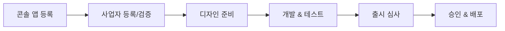
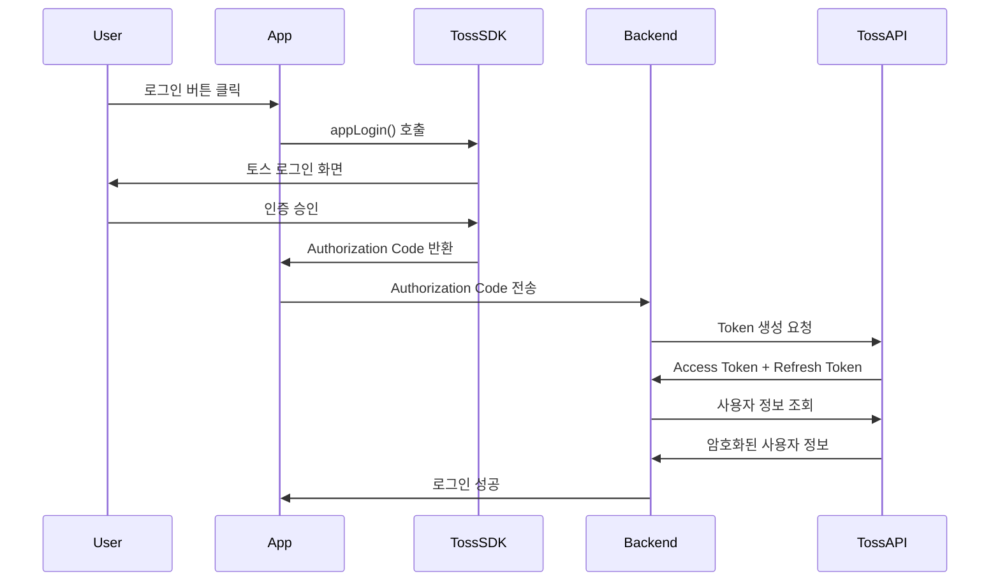
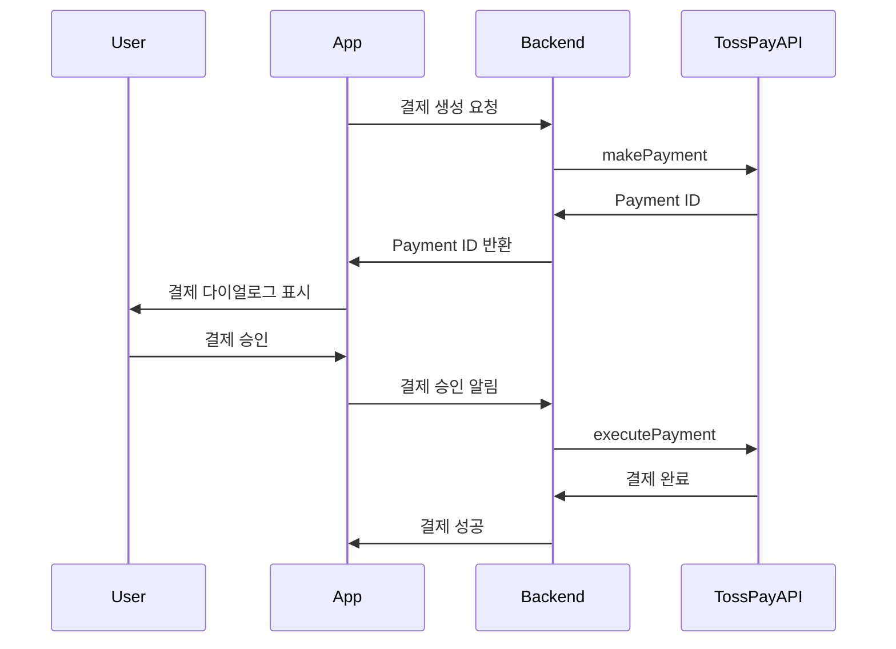
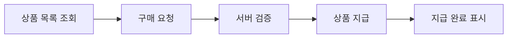

# 앱인토스 (Apps in Toss) 완전 개발 가이드

> 📚 **출처**: https://developers-apps-in-toss.toss.im
> 📅 **최종 업데이트**: 2026-01-21
> 🔄 **크롤링 버전**: v1.0.0

---

## 📑 목차

1. [시작하기](#1-시작하기)
2. [디자인 가이드](#2-디자인-가이드)
3. [개발 가이드](#3-개발-가이드)
4. [인증 시스템](#4-인증-시스템)
5. [결제 시스템](#5-결제-시스템)
6. [마케팅 & 분석](#6-마케팅--분석)
7. [출시 체크리스트](#7-출시-체크리스트)
8. [API & SDK 레퍼런스](#8-api--sdk-레퍼런스)

---

## 1. 시작하기

### 1.1 앱인토스란?

**앱인토스**는 토스 앱 내에서 실행되는 미니앱 플랫폼입니다.

**핵심 장점:**
- 🎯 토스의 **1,200만+ MAU**에 즉시 접근
- 📱 **별도 앱 설치 없이** 사용 가능
- 🎨 토스의 **디자인 시스템(TDS)** 활용
- 💳 **토스 로그인, 토스페이** 등 네이티브 기능 통합

**지원 플랫폼:**
- ✅ WebView (React, Vue 등)
- ✅ React Native
- ✅ Unity (WebGL 변환)

---

### 1.2 온보딩 프로세스



**단계별 상세:**

1. **콘솔 등록**: [Apps in Toss 콘솔](https://console.apps-in-toss.toss.im)에서 앱 생성
2. **사업자 인증**: 사업자 등록증 및 대표자 정보 제출
3. **디자인 준비**: Figma 또는 App Builder 사용
4. **개발**: WebView/React Native/Unity 중 선택
5. **테스트**: 샌드박스 앱으로 로컬/원격 테스트
6. **심사**: 출시 체크리스트 완료 후 제출
7. **배포**: 승인 후 토스 앱에 배포

---

### 1.3 정책 및 주의사항

#### ⚠️ 금지 사항
- ❌ 불법 또는 선정적 콘텐츠
- ❌ 다크 패턴 (사용자 기만 디자인)
- ❌ 회사 앱/웹사이트로 유도
- ❌ 현금성 또는 투기성 이벤트
- ❌ iframe 사용 (YouTube 제외)

#### ✅ 필수 준수 사항
- 비게임 앱은 **TDS 필수 사용**
- **토스 로그인만** 허용 (타 로그인 불가)
- **토스페이만** 허용 (타 결제 수단 불가)
- **다크모드 미제공** (라이트 모드만)
- **핀치 줌 비활성화** (지도 제외)

---

## 2. 디자인 가이드

### 2.1 브랜딩 가이드라인

#### 로고 규격
```
크기: 600×600px 정사각형
형태: 각진 모서리 (둥근 모서리 ❌)
배경: 라이트/다크 모드 모두 필요
설정: granite.config.ts > brand.icon
```

#### 앱 이름
- **언어**: 한글 기본 (영문 비권장)
- **설정**: `brand.displayName`

#### 브랜드 컬러
- **형식**: Hex 코드 (예: `#3182F6`)
- **설정**: `brand.primaryColor`
- **자동 보정**: 대비 기준 미달 시 시스템이 자동 조정

---

### 2.2 UX 라이팅 가이드

#### 톤 앤 매너
```
✅ 해요체 사용: "서비스를 시작해요"
❌ 합니다체 금지: "서비스를 시작합니다"
```

#### 5가지 핵심 원칙

1. **능동형 우선**
   - ✅ "저장했어요"
   - ❌ "저장됐어요"

2. **긍정적 표현**
   - ✅ "Wi-Fi에 연결하면 사용할 수 있어요"
   - ❌ "Wi-Fi 없이는 사용할 수 없어요"

3. **과도한 존칭 제거**
   - ✅ "사용자에게"
   - ❌ "사용자께"

4. **명사 나열 지양**
   - ✅ "서비스가 종료돼서"
   - ❌ "서비스 종료로 인해"

5. **공백 최적화**
   - ✅ "저장돼요"
   - ❌ "저장되어요"

---

### 2.3 다크 패턴 방지 정책

#### 5대 금지 사항

1. **진입 방해 금지**
   - 서비스 진입 시 전면 바텀시트 즉시 노출 ❌

2. **이탈 시 동의 요청 금지**
   - 뒤로가기 버튼 차단하며 권한 요청 ❌

3. **거절 옵션 필수**
   - 프로모션 CTA에 거절 옵션 없음 ❌

4. **광고 타이밍 조절**
   - 자연스러운 워크플로우 중 갑작스러운 전면 광고 ❌

5. **명확한 CTA**
   - 모호하거나 반복적인 CTA 텍스트 ❌

---

### 2.4 TDS (Toss Design System)

#### 개요
TDS는 토스 제품 전반에 사용되는 **통합 디자인 시스템**입니다.

#### 장점
- 🎯 **일관된 UX**: 모든 토스 제품에서 동일한 경험
- ⚡ **빠른 개발**: 개발자는 **3~5배** 빠른 속도
- 🎨 **고품질**: 디자이너는 문제 해결에 집중

#### 11대 핵심 컴포넌트

| 컴포넌트 | 용도 |
|---------|------|
| Badge | 시각적 표시 |
| Border | 테두리 스타일링 |
| BottomCTA | 하단 CTA 버튼 |
| Button | 상호작용 버튼 |
| Asset | 공통 에셋 |
| ListRow | 리스트 행 |
| ListHeader | 리스트 헤더 |
| Navigation | 네비게이션 바 |
| Paragraph | 텍스트/타이포그래피 |
| Tab | 탭 인터페이스 |
| Top | 상단 네비게이션 |

#### 문서 링크
- **WebView**: https://tossmini-docs.toss.im/tds-mobile/
- **React Native**: https://tossmini-docs.toss.im/tds-react-native/

---

## 3. 개발 가이드

### 3.1 WebView 개발

#### 프로젝트 생성

```bash
# 새 프로젝트
npm create vite@latest my-app -- --template react-ts
cd my-app
npm install

# 기존 프로젝트
npm install @apps-in-toss/web-framework

# 초기화
npx ait init
```

#### 설정 파일: `granite.config.ts`

```typescript
export default {
  appName: 'my-mini-app',        // 콘솔 등록명과 일치
  displayName: '내 미니앱',       // 사용자 표시명
  primaryColor: '#3182F6',        // 브랜드 컬러
  icon: '/icon.png',              // 앱 아이콘

  web: {
    host: 'localhost',            // 개발 서버 호스트
    port: 8081,                   // 개발 서버 포트
    commands: {
      dev: 'npm run dev',         // 개발 명령어
      build: 'npm run build'      // 빌드 명령어
    },
    outdir: 'dist'                // 빌드 출력 디렉토리
  }
}
```

#### 필수 요구사항
- ✅ **비게임 앱은 TDS 필수 사용**
- ✅ `web.commands.build` 출력이 `outdir`과 일치해야 함

#### 테스트

```bash
# 로컬 개발
npm run dev

# Android 테스트
adb reverse tcp:8081 tcp:8081

# iOS 테스트
# 1. 동일 WiFi 연결
# 2. 로컬 네트워크 권한 허용
# 3. 샌드박스 앱에서 IP 입력
```

#### 원격 접근 (실제 디바이스)

```typescript
// granite.config.ts
export default {
  web: {
    host: '192.168.0.100',  // 로컬 IP
    commands: {
      dev: 'npm run dev -- --host'  // --host 플래그 추가
    }
  }
}
```

---

### 3.2 React Native 개발

#### 프로젝트 생성

```bash
# Granite 앱 생성
npm create granite-app
# 또는
pnpm create granite-app
yarn create granite-app

# 프롬프트
# - 앱 이름: kebab-case 형식
# - 개발 도구: prettier + eslint 또는 biome
# - 패키지 매니저 선택
```

#### 프레임워크 설치

```bash
npm install @apps-in-toss/framework
npx ait init
```

#### 설정 파일: `granite.config.ts`

```typescript
export default {
  appName: 'my-mini-app',        // 콘솔 등록명과 일치
  displayName: '내 미니앱',       // 네비게이션 바 레이블
  primaryColor: '#3182F6',        // RGB HEX 형식
  icon: 'https://example.com/icon.png'  // 앱 아이콘 URL
}
```

#### 파일 기반 라우팅 (Next.js 방식)

```
pages/
  index.tsx       → intoss://my-mini-app
  detail.tsx      → intoss://my-mini-app/detail
  item/
    index.tsx     → intoss://my-mini-app/item
    [id].tsx      → intoss://my-mini-app/item/:id
```

**URL Scheme**: 모든 라우트는 `intoss://` 접두사로 시작

#### 앱 등록 코드

```typescript
// pages/_app.tsx
import { AppsInToss } from '@apps-in-toss/framework';

export default AppsInToss.registerApp(AppContainer, { context });
```

#### 개발 & 빌드

```bash
# 개발 서버 시작
npm run dev

# Android 포트 포워딩
adb reverse tcp:8081 tcp:8081

# 프로덕션 빌드
npm run build  # .ait 번들 파일 생성
```

---

### 3.3 Unity 개발

#### 개요
- 기존 Unity 게임을 **WebGL**로 변환하여 앱인토스에 배포
- 게임 엔진 변경 불필요
- 핵심 코드 유지

#### 장점
- ✅ 최소한의 개발 리소스
- ✅ 기존 프로젝트 구조 유지
- ✅ 효율적인 변환 프로세스

#### 문서 구조
- 호환성 평가
- 권장 Unity 버전
- 성능 최적화 (시작 속도, 메모리, 그래픽)
- 디버깅 & 프로파일링

#### 지원
- **커뮤니티**: https://techchat-apps-in-toss.toss.im/
- **문서**: https://developers-apps-in-toss.toss.im/unity/

---

### 3.4 Firebase 통합

#### 개요
Firebase 인증, Firestore, Storage 등을 앱인토스 WebView 환경에서 사용 가능

#### 설정 단계

```bash
# 1. Firebase SDK 설치
npm install firebase

# 2. .env 파일 생성 (환경 변수)
VITE_FIREBASE_API_KEY=your_api_key
VITE_FIREBASE_AUTH_DOMAIN=your-project.firebaseapp.com
VITE_FIREBASE_PROJECT_ID=your-project-id
VITE_FIREBASE_STORAGE_BUCKET=your-bucket.appspot.com
VITE_FIREBASE_MESSAGING_SENDER_ID=123456789
VITE_FIREBASE_APP_ID=your-app-id
```

#### 초기화 파일: `src/firebase/init.ts`

```typescript
import { initializeApp, getApps } from 'firebase/app'
import { getAuth } from 'firebase/auth'
import { getFirestore } from 'firebase/firestore'
import { getStorage } from 'firebase/storage'

const firebaseConfig = {
  apiKey: import.meta.env.VITE_FIREBASE_API_KEY,
  authDomain: import.meta.env.VITE_FIREBASE_AUTH_DOMAIN,
  projectId: import.meta.env.VITE_FIREBASE_PROJECT_ID,
  storageBucket: import.meta.env.VITE_FIREBASE_STORAGE_BUCKET,
  messagingSenderId: import.meta.env.VITE_FIREBASE_MESSAGING_SENDER_ID,
  appId: import.meta.env.VITE_FIREBASE_APP_ID
}

const app = getApps().length ? getApps()[0] : initializeApp(firebaseConfig)

export const auth = getAuth(app)
export const db = getFirestore(app)
export const storage = getStorage(app)
```

#### 보안 체크리스트
- ✅ `.env` 파일을 `.gitignore`에 추가
- ✅ Firestore 보안 규칙 설정
- ✅ Firebase 콘솔에서 허용 도메인 제한
  - 프로덕션: `https://<appName>.apps.tossmini.com`
  - 테스트: `https://<appName>.private-apps.tossmini.com`
- ✅ 인증된 사용자만 민감 데이터 접근

---

## 4. 인증 시스템

### 4.1 토스 로그인

#### 인증 플로우



#### SDK 메서드

```typescript
import { Login } from '@apps-in-toss/web-framework'

// 로그인 시작
const { code, referrer } = await Login.appLogin()
// code: Authorization Code
// referrer: "sandbox" (테스트) 또는 "DEFAULT" (프로덕션)
```

#### Token 수명
- **Authorization Code**: 10분
- **Access Token**: 1시간
- **Refresh Token**: 14일

#### API 엔드포인트

```bash
# 1. Access Token 생성
POST https://apps-in-toss-api.toss.im/api-partner/v1/apps-in-toss/user/oauth2/generate-token

# 2. Token 갱신
POST https://apps-in-toss-api.toss.im/api-partner/v1/apps-in-toss/user/oauth2/refresh-token

# 3. 사용자 정보 조회
POST https://apps-in-toss-api.toss.im/api-partner/v1/apps-in-toss/user/oauth2/login-me
```

#### 사용자 정보 복호화 (AES-256-GCM)

```javascript
// Node.js 예제
const crypto = require('crypto')

function decrypt(encryptedData, aesKey, aad) {
  const buffer = Buffer.from(encryptedData, 'base64')
  const iv = buffer.slice(0, 12)  // 첫 12바이트
  const authTag = buffer.slice(-16)  // 마지막 16바이트
  const ciphertext = buffer.slice(12, -16)

  const decipher = crypto.createDecipheriv('aes-256-gcm', Buffer.from(aesKey, 'base64'), iv)
  decipher.setAuthTag(authTag)
  decipher.setAAD(Buffer.from(aad, 'utf8'))

  const decrypted = Buffer.concat([
    decipher.update(ciphertext),
    decipher.final()
  ])

  return JSON.parse(decrypted.toString('utf8'))
}
```

#### 세션 종료

```bash
# Access Token으로 종료
POST /api-partner/v1/apps-in-toss/user/oauth2/access/remove-by-access-token

# User Key로 종료
POST /api-partner/v1/apps-in-toss/user/oauth2/access/remove-by-user-key
```

---

### 4.2 게임 로그인

- 게임 특화 로그인 시스템
- Toss Login에서 마이그레이션 가능
- 문서: `/game-login/intro`

---

### 4.3 토스 인증 (Toss Auth)

- 본인 인증 서비스
- 계약, 테스트, 개발 가이드 제공
- 문서: `/tossauth/contract`

---

## 5. 결제 시스템

### 5.1 토스페이 (Toss Pay)

#### 결제 플로우



#### API Base URL
```
https://pay-apps-in-toss-api.toss.im
```

#### 주요 엔드포인트

| 작업 | Method | Endpoint |
|-----|--------|----------|
| 결제 생성 | POST | `/api-partner/v1/apps-in-toss/pay/make-payment` |
| 결제 실행 | POST | `/api-partner/v1/apps-in-toss/pay/execute-payment` |
| 결제 상태 조회 | POST | `/api-partner/v1/apps-in-toss/pay/get-payment-status` |
| 환불 | POST | `/api-partner/v1/apps-in-toss/pay/refund-payment` |

#### 필수 헤더
```
x-toss-user-key: {userKey from Toss Login}
```

#### 필수 파라미터

```json
{
  "orderNo": "ORDER123456",           // 최대 50자, 영숫자 + _-:.^@
  "productDesc": "상품명",             // 최대 255자, UTF-8
  "amount": 10000,                    // 총 결제 금액 (정수)
  "amountTaxFree": 0,                 // 비과세 금액
  "isTestPayment": false              // 샌드박스/라이브 환경
}
```

#### 결제 상태

| 상태 | 의미 |
|-----|------|
| `PAY_STANDBY` | 처리 대기 중 |
| `PAY_APPROVED` | 고객 인증 완료 |
| `PAY_COMPLETE` | 거래 완료 |
| `REFUND_PROGRESS` | 환불 진행 중 |
| `REFUND_SUCCESS` | 환불 완료 |

#### 응답 데이터

```json
{
  "transactionId": "TXN123456789",    // 정산용 고유 ID
  "paidAmount": 9500,                 // 할인 후 최종 금액
  "discountedAmount": 500,            // 적용된 할인
  "payMethod": "TOSS_MONEY",          // TOSS_MONEY 또는 CARD
  "cardInfo": {                       // 결제 수단 정보 (부분 마스킹)
    "cardNumber": "1234-****-****-5678",
    "installment": 0
  }
}
```

#### 주요 에러 코드

| 코드 | 의미 |
|-----|------|
| `PAYMENT_EXISTING_PAYMENT` | 중복 주문 번호 |
| `COMMON_INVALID_API_KEY` | 인증 실패 |
| `COMMON_BREAK_TIME_OF_BANK` | 은행 점검 시간 |

---

### 5.2 인앱 구매 (IAP)

#### 요구사항
- **SDK**: 1.1.3 이상 (상품 지급 완료 기능)
- **구매 복원**: 1.2.2 이상
- **데이터 지속성**: 기기 변경 시에도 상품 유지
- **전제 조건**: Toss Login 통합 필수

#### 구매 플로우



#### SDK 메서드

```typescript
import { IAP } from '@apps-in-toss/web-framework'

// 1. 상품 목록 조회
const products = await IAP.getProductItemList()

// 2. 구매 시작
const order = await IAP.createOneTimePurchaseOrder({
  productId: 'com.example.product1'
})

// 3. 미완료 주문 복구 (서버 지급 실패 시)
const pendingOrders = await IAP.getPendingOrders()
for (const order of pendingOrders) {
  // 상품 지급 로직
  await grantProduct(order)

  // 지급 완료 표시
  await IAP.completeProductGrant(order.orderId)
}

// 4. 완료된 주문 조회
const completed = await IAP.getCompletedOrRefundedOrders()
```

#### 중요 시나리오
1. ✅ 성공적인 결제 및 콜백 전달
2. ⚠️ **결제 완료 but 상품 미지급** → `getPendingOrders()`로 복구
3. ❌ 네트워크/취소/내부 오류 처리

---

## 6. 마케팅 & 분석

### 6.1 푸시 알림

#### 테스트 메시지 API
개발 중 알림 기능 검증용

#### 프로덕션 메시지 API

```bash
POST https://apps-in-toss-api.toss.im/api-partner/v1/apps-in-toss/messenger/send-message
Content-Type: application/json
x-toss-user-key: {userKey}
```

**요청 예제:**
```json
{
  "templateSetCode": "order_update_01",
  "context": {
    "storeName": "토스증권",
    "deliveryDate": "2026-01-21 15:30"
  }
}
```

**응답:**
- 메시지 수
- 채널별 전달 수 (푸시, 인박스, SMS, 알림톡, 친구톡)
- 성공/실패 배열 및 상세 이유

---

### 6.2 애널리틱스

#### 로깅 타입

**1. 페이지 네비게이션 로그**
- 자동 기록 (추가 설정 불필요)

**2. 클릭 이벤트 로깅**

```javascript
import { Analytics } from "@apps-in-toss/web-framework"

document.getElementById("subscribeBtn").addEventListener("click", () => {
  Analytics.click({ button_name: "subscribe_button" })
})
```

**3. 노출 이벤트 로깅**

```javascript
const observer = new IntersectionObserver(
  ([entry]) => {
    if (entry.isIntersecting) {
      Analytics.impression({
        item_id: entry.target.dataset.itemId,
        item_category: "premium_product"
      })
      observer.disconnect()  // 한 번만 기록
    }
  },
  { threshold: 0.1 }  // 10% 노출 시
)

observer.observe(document.getElementById("productItem"))
```

#### 베스트 프랙티스
- ✅ 의미 있는 상호작용만 로깅
- ✅ 구체적인 파라미터 사용 (`button_name: "subscribe_button"`)
- ✅ 이탈 단계 식별 후 타겟 UI 개선

#### 데이터 가용성
- **SDK 버전**: 0.0.26 이상
- **데이터 표시**: 서비스 출시 후 24시간 지연
- **제외**: 샌드박스 및 출시 전 데이터
- **접근**: 콘솔 > Analytics > Events

---

### 6.3 인앱 광고 (AdMob)

#### 지원 광고 타입

| 타입 | 테스트 ID |
|-----|-----------|
| 전면 광고 | `ait-ad-test-interstitial-id` |
| 리워드 광고 | `ait-ad-test-rewarded-id` |

#### 구현 프로세스

```typescript
import { Ads } from '@apps-in-toss/web-framework'

// 1. 광고 로드 (페이지당 로드)
await Ads.loadAppsInTossAdMob({
  adUnitId: 'ait-ad-test-interstitial-id'
})

// 2. 광고 표시 (로드 완료 후)
await Ads.showAppsInTossAdMob()
```

#### 베스트 프랙티스
- ⚠️ **테스트 ID 사용** (프로덕션 ID는 계정 페널티)
- 🔄 **순차 로드**: 로드 → 표시 → 다음 로드 → 표시
- 📱 **페이지당 로드**: 낮은 fill-rate 방지
- 🚫 **샌드박스 미지원**: 콘솔 QR 코드 테스트 사용

---

## 7. 출시 체크리스트

### 7.1 비게임 앱 체크리스트

#### 사전 요구사항
- [ ] 콘솔에서 앱 정보 검토
- [ ] 사업자 인증 완료
- [ ] 대표 관리자 승인

#### 시스템 & 디스플레이
- [ ] 다크모드 미제공 (라이트 모드만)
- [ ] 핀치 줌 비활성화 (meta viewport 설정)
  ```html
  <meta name="viewport" content="width=device-width, initial-scale=1, maximum-scale=1, user-scalable=no">
  ```

#### 네비게이션 바
- [ ] 요소 크기/색상/위치 커스터마이징 안 함
- [ ] 더보기 메뉴(⋯) 필수
- [ ] 닫기 버튼(X) 필수
- [ ] 뒤로가기, 홈, 파트너 기능 버튼 (선택)

#### 성능 기준
- [ ] 상호작용 응답 시간 **2초 이내**
- [ ] 재연결 시 사용자 데이터 유지
- [ ] 모든 컴포넌트 정상 작동
- [ ] 리스트 작업 (정렬/필터링/검색) 정상

#### 접근성
- [ ] 텍스트/버튼 충분한 대비율
- [ ] 적절한 터치 타겟 영역 (최소 44×44px)
- [ ] 애니메이션 속도 적절
- [ ] 스크린 리더 호환

#### 토스 로그인 (사용 시)
- [ ] 토스 로그인만 허용
- [ ] 약관 표시 및 동의 체크박스
- [ ] 로그아웃 정상 작동
- [ ] 인트로 화면 (서비스 가치 설명)

#### 결제 (사용 시)
- [ ] 토스페이만 허용
- [ ] IAP는 Apple/Google Play 통합
- [ ] 앱-결제 게이트웨이 금액 일치
- [ ] 환불 워크플로우 정상

#### 메시징 & 광고 (사용 시)
- [ ] 푸시는 기능성 알림만 (주문/배송)
- [ ] 광고 미리 로드 & 지연 없이 표시
- [ ] 리워드 광고는 완전 시청 후 보상
- [ ] 테스트 광고 ID 제거

#### 금지 콘텐츠
- [ ] 불법/선정적 자료 없음
- [ ] 다크 패턴 없음
- [ ] 회사 앱/웹사이트 유도 없음
- [ ] 현금성/투기성 이벤트 없음

#### 최종 제출
- [ ] 약관 및 개인정보처리방침 링크
- [ ] 고객센터 연락처
- [ ] 앱 스크린샷 (3~5장)
- [ ] 앱 소개 동영상 (선택)

---

### 7.2 게임 앱 체크리스트

별도 문서 참조: `/checklist/app-game`

---

## 8. API & SDK 레퍼런스

### 8.1 API 개요

#### Base URLs
```
메인 API: https://apps-in-toss-api.toss.im
결제 API: https://pay-apps-in-toss-api.toss.im
```

#### 인프라 요구사항

**mTLS 인증**
- 서버 간 통신을 위한 양방향 TLS 인증서 필수

**방화벽 설정**
- **Inbound IPs**: 117.52.3.11, 211.115.96.11, 106.249.5.11
- **Outbound**: 로그인/메시징 및 결제 서비스 엔드포인트

#### 응답 형식

**성공:**
```json
{
  "resultType": "SUCCESS",
  "success": { /* 데이터 */ }
}
```

**실패:**
```json
{
  "resultType": "FAIL",
  "error": {
    "errorCode": "INVALID_PARAMETER",
    "reason": "orderNo는 필수 파라미터입니다"
  }
}
```

---

### 8.2 SDK 카테고리

| 카테고리 | 기능 |
|---------|------|
| **Navigation** | 라우팅, URL 열기, 뷰 닫기, 스와이프 |
| **Authentication** | 토스 로그인, 토스 인증, 게임 로그인 |
| **Content** | 공유, 친구 초대, 프로모션, 리더보드 |
| **Payment** | 토스페이, 인앱 구매, 광고 |
| **Analytics** | 사용자 추적, 노출, 클릭 |
| **Device** | 위치, 스토리지, 카메라, 사진, 클립보드, 연락처 |
| **Network** | 네트워크 상태, HTTP, 디바이스 정보, 플랫폼 감지 |
| **Localization** | 로케일 |

---

### 8.3 주요 API 엔드포인트 요약

#### 인증
```
POST /api-partner/v1/apps-in-toss/user/oauth2/generate-token
POST /api-partner/v1/apps-in-toss/user/oauth2/refresh-token
POST /api-partner/v1/apps-in-toss/user/oauth2/login-me
POST /api-partner/v1/apps-in-toss/user/oauth2/access/remove-by-access-token
POST /api-partner/v1/apps-in-toss/user/oauth2/access/remove-by-user-key
```

#### 결제
```
POST /api-partner/v1/apps-in-toss/pay/make-payment
POST /api-partner/v1/apps-in-toss/pay/execute-payment
POST /api-partner/v1/apps-in-toss/pay/get-payment-status
POST /api-partner/v1/apps-in-toss/pay/refund-payment
POST /api-partner/v1/apps-in-toss/iap/get-order-status
```

#### 프로모션
```
POST /api-partner/v1/apps-in-toss/promotion/execute
POST /api-partner/v1/apps-in-toss/promotion/get-execution-result
POST /api-partner/v1/apps-in-toss/promotion/get-key
```

#### 메시징
```
POST /api-partner/v1/apps-in-toss/messenger/send-message
POST /api-partner/v1/apps-in-toss/messenger/send-test-message
```

---

## 📚 추가 리소스

### 공식 문서
- **개발자 센터**: https://developers-apps-in-toss.toss.im
- **TDS WebView**: https://tossmini-docs.toss.im/tds-mobile/
- **TDS React Native**: https://tossmini-docs.toss.im/tds-react-native/

### 커뮤니티
- **개발자 포럼**: https://techchat-apps-in-toss.toss.im/
- **피드백**: https://apps-in-toss.channel.io/workflows/787658

### 예제 코드
- **Cocos 예제**: https://github.com/toss/apps-in-toss-cocos-examples

### 기타
- **Release Notes**: https://developers-apps-in-toss.toss.im/release-note
- **FAQ**: https://developers-apps-in-toss.toss.im/faq

---

## 🎯 핵심 요약

### 필수 준수 사항
1. ✅ 비게임 앱은 **TDS 필수**
2. ✅ **토스 로그인만** 허용
3. ✅ **토스페이만** 허용
4. ✅ **다크 패턴 금지**
5. ✅ **iframe 금지** (YouTube 제외)
6. ✅ **라이트 모드만** (다크모드 ❌)
7. ✅ **핀치 줌 비활성화** (지도 제외)

### 개발 플로우
```
콘솔 등록 → 사업자 인증 → 디자인 준비 (TDS) → 개발 → 테스트 → 출시 심사 → 배포
```

### 성능 기준
- ⚡ 응답 시간: **2초 이내**
- 💾 재연결 시 데이터 유지
- ✅ 모든 기능 정상 작동

### 보안 체크리스트
- 🔐 Firebase: 환경 변수 사용, .env 보호
- 🔒 Firestore: 보안 규칙 설정
- 🌐 Firebase: 허용 도메인 제한
- 🔑 mTLS: 인증서 구성
- 🛡️ 방화벽: IP 허용 목록
- 🔐 사용자 데이터: AES-256-GCM 암호화

---

**문서 버전**: v1.0.0
**최종 업데이트**: 2026-01-21
**크롤링 출처**: https://developers-apps-in-toss.toss.im

---

📝 **이 문서는 앱인토스 공식 개발자 센터를 크롤링하여 자동 생성되었습니다.**
